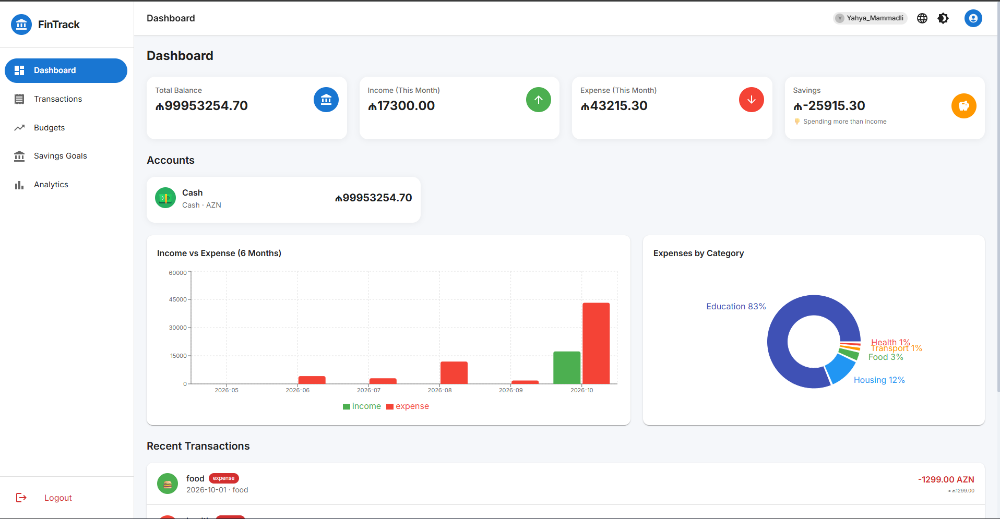
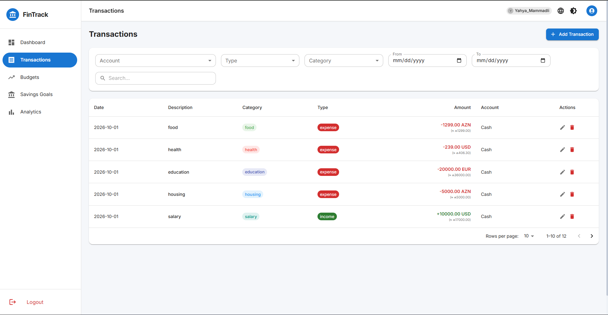
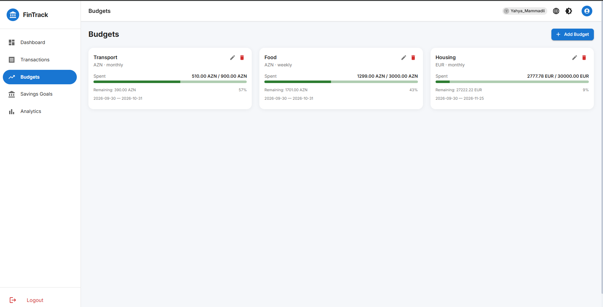
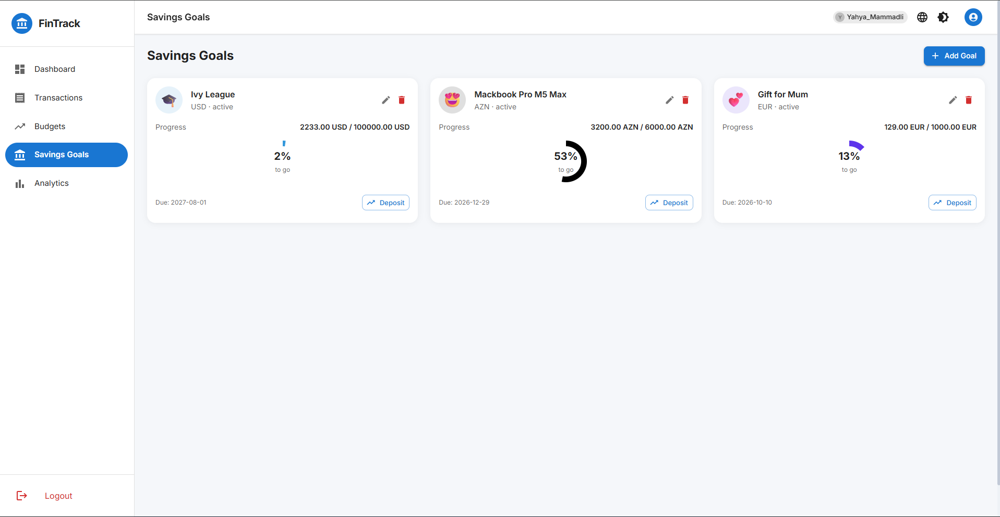
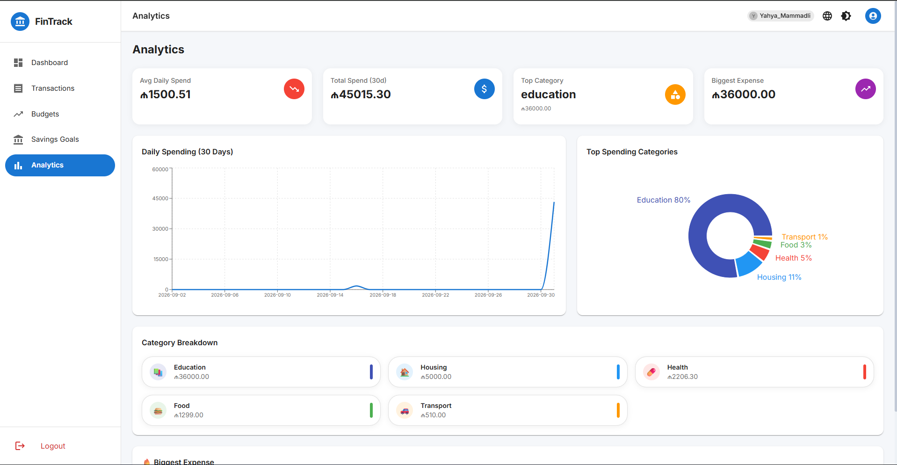

# 💰 FinTrack — Full-Stack Personal Finance Tracker


A comprehensive **full-stack web application** designed to help users track personal finances, manage budgets, set savings goals, and visualize spending trends — all in one clean, modern, mobile-first interface.

> 🔗 **[Live Demo](https://your-demo-link.com)** *(replace with real URL after deployment)*

---

## 📖 Table of Contents

- [Features](#-features)
- [Tech Stack](#-tech-stack)
- [Project Structure](#-project-structure)
- [Getting Started](#-getting-started)
- [Environment Variables](#-environment-variables)
- [API Overview](#-api-overview)
- [Key Logic: Automatic Balance Sync](#-key-logic-automatic-balance-sync)
- [Data Model](#-data-model)
- [Screenshots](#-screenshots)
- [Roadmap](#-roadmap)
- [Contributing](#-contributing)
- [License](#-license)

---

## ✨ Features

- **🔐 Authentication** — Secure JWT-based registration and login system with SHA-512 password hashing.
- **💳 Accounts Management** — Support for multiple account types (Cash, Card, Savings) with different currencies (AZN, USD, EUR).
- **📊 Transactions** — Full CRUD for income, expense, and transfer transactions. Includes automatic balance synchronization, tags, filtering, search, and pagination.
- **🎯 Budgets** — Create monthly or weekly budgets per category. The system automatically calculates spent amounts and remaining balances in real time.
- **🏆 Savings Goals** — Set financial goals, track progress with circular progress bars, and make deposits. Goals auto-complete when the target amount is reached.
- **📈 Analytics** — Interactive charts (Recharts) for daily spending, income vs. expense, and category breakdowns.
- **🌙 UI/UX** — Responsive Mobile-first design with Material-UI, Dark/Light theme toggle, smooth transitions, and debounced search.
- **🌍 Localization** — Multi-language support (English, Russian, Azerbaijani) using `i18next`.
- **💱 Currency Conversion** — Built-in exchange rate conversion between AZN, USD, and EUR for transfers and cross-currency transactions.

---

## 🛠 Tech Stack

### Frontend
- **React 18** (bootstrapped with Vite)
- **Material-UI (MUI 5)** — components & theming
- **Recharts** — interactive charts and data visualization
- **React Router v6** — client-side routing
- **i18next + react-i18next** — internationalization
- **Context API + `useReducer`** — global state management (`AppDataContext`, `AuthContext`, `ThemeContext`)
- **Vite** — lightning-fast build tool

### Backend
- **Node.js + Express.js** — RESTful API
- **JSON Web Tokens (JWT)** — stateless auth
- **JSON file database (`db.json`)** — zero-config, no external DB required for testing
- **`uuid`** — unique ID generation
- **`crypto` (built-in)** — SHA-512 password hashing

---

## 📂 Project Structure

```text
finance-tracker/
├── backend/
│   ├── src/
│   │   ├── controllers/       # Business logic (accounts, transactions, budgets, goals, stats, auth)
│   │   ├── middleware/        # DB read/write, JWT middleware
│   │   ├── routes/            # Express API endpoints
│   │   └── index.js           # Server entry point
│   ├── db.json                # Persistent JSON database (seeded)
│   ├── seed.js                # Script to generate fresh dummy data
│   └── package.json
│
├── frontend/
│   ├── src/
│   │   ├── api/               # API fetch wrappers (api.js)
│   │   ├── components/        # Reusable UI components (TransactionForm, LanguageSwitcher, etc.)
│   │   ├── context/           # AuthContext, ThemeContext
│   │   ├── hooks/             # Custom hooks (useDebounce)
│   │   ├── layout/            # Layout with sidebar navigation
│   │   ├── pages/             # Dashboard, Transactions, Budgets, Goals, Analytics, Login, Register
│   │   ├── store/             # AppDataContext (global state + reducer)
│   │   └── i18n.js            # Localization setup
│   └── package.json
│
└── README.md
```

---

## 🚀 Getting Started

### Prerequisites

- **Node.js** (v18 or higher)
- **npm** or **yarn**

### 1. Clone the repository

```bash
git clone https://github.com/your-username/finance-tracker.git
cd finance-tracker
```

### 2. Setup the Backend

```bash
cd backend
npm install
# Generate fresh seed data (creates/updates db.json with realistic data for the last 90 days)
npm run seed
# Start the server (defaults to http://localhost:5000)
npm start
```

> **Note:** The backend uses a JSON file as a database. You don't need MongoDB or PostgreSQL to run this locally.

### 3. Setup the Frontend

Open a new terminal window:

```bash
cd frontend
npm install
npm run dev
```

The app will be available at `http://localhost:5173`.

---

## 🔑 Environment Variables

Create a `.env` file in the `backend` directory:

```env
PORT=5000
JWT_SECRET=your_super_secret_key_here
```

> ⚠️ **Important:** Use a long, random string for `JWT_SECRET`. Never commit the `.env` file to Git.

---

## 🔌 API Overview

The backend provides a RESTful API. All protected endpoints require a `Bearer` token in the `Authorization` header.

| Method | Endpoint | Description |
|--------|----------|-------------|
| `POST` | `/api/auth/register` | Register a new user |
| `POST` | `/api/auth/login` | Login and receive JWT |
| `GET` | `/api/accounts` | Get all user accounts |
| `POST` | `/api/accounts` | Create a new account |
| `PUT` | `/api/accounts/:id` | Update account |
| `DELETE` | `/api/accounts/:id` | Delete account (and its transactions) |
| `GET` | `/api/accounts/:id/transactions` | Get transactions of an account |
| `GET` | `/api/transactions` | Get transactions (with filters & pagination) |
| `POST` | `/api/transactions` | Create a transaction (auto-updates balance) |
| `PUT` | `/api/transactions/:id` | Update a transaction |
| `DELETE` | `/api/transactions/:id` | Delete a transaction |
| `GET` | `/api/budgets` | Get budgets with computed `spent` / `remaining` |
| `POST` | `/api/budgets` | Create a budget |
| `PUT` | `/api/budgets/:id` | Update a budget |
| `DELETE` | `/api/budgets/:id` | Delete a budget |
| `GET` | `/api/goals` | Get all savings goals |
| `POST` | `/api/goals` | Create a goal |
| `PUT` | `/api/goals/:id` | Update a goal |
| `DELETE` | `/api/goals/:id` | Delete a goal |
| `PATCH`| `/api/goals/:id/deposit` | Deposit into a savings goal |
| `GET` | `/api/stats/overview` | Dashboard statistics (balance, income, expense) |
| `GET` | `/api/stats/trends` | Spending trends (30 days, top categories) |

For detailed API documentation, including request/response examples, please refer to the controller comments or the extended backend README.

---

## 🧠 Key Logic: Automatic Balance Sync

The backend automatically keeps account balances in sync with every transaction. No manual recalculation is needed.

| Action | Effect on balance |
|--------|-------------------|
| Create `income` | `+amount` on the account |
| Create `expense` | `-amount` on the account |
| Create `transfer` | `-amount` on source, `+amount` on `toAccountId` |
| Update any transaction | Old effect is **reverted**, new effect is **applied** |
| Delete any transaction | Effect is fully **reverted** |

This ensures data integrity even when users edit or delete transactions — the balance stays consistent with the transaction history.

---

## 📊 Data Model

### Account
| Field | Type | Description |
|-------|------|-------------|
| `id` | string | UUID |
| `name` | string | Account name |
| `type` | string | `cash` / `card` / `savings` |
| `balance` | number | Current balance (auto-maintained) |
| `currency` | string | `AZN` / `USD` / `EUR` |
| `color` | string | Hex color |
| `icon` | string | Emoji |

### Transaction
| Field | Type | Description |
|-------|------|-------------|
| `id` | string | UUID |
| `accountId` | string | Source account |
| `toAccountId` | string | (transfers only) receiving account |
| `type` | string | `income` / `expense` / `transfer` |
| `amount` | number | Positive number |
| `currency` | string | Currency of the transaction |
| `category` | string | `food`, `transport`, `housing`, `health`, `entertainment`, `education`, `shopping`, `salary`, `freelance`, `gift`, `other` |
| `description` | string | Freeform text |
| `date` | string | `YYYY-MM-DD` |
| `time` | string | `HH:MM` |
| `tags` | string[] | Freeform tags |
| `isRecurring` | boolean | Marks recurring transactions |

### Budget / Goal
See the extended API documentation in the backend source code.

---

## 📸 Screenshots

*(Add screenshots to the `screenshots/` folder in the repository and replace the paths below)*

### Dashboard


### Transactions


### Goals


### Goals


### Analytics



---

## 🗺 Roadmap

- [x] JWT authentication
- [x] Full CRUD for accounts, transactions, budgets, goals
- [x] Analytics with interactive charts
- [x] Multi-language support (EN / RU / AZ)
- [x] Dark / Light theme
- [ ] Export data to CSV / Excel
- [ ] Recurring transactions engine
- [ ] Mobile app (React Native)
- [ ] Two-factor authentication
- [ ] Email notifications for budget overspend

---

## 🤝 Contributing

Contributions, issues, and feature requests are welcome!

1. Fork the project
2. Create your feature branch (`git checkout -b feature/AmazingFeature`)
3. Commit your changes (`git commit -m 'Add some AmazingFeature'`)
4. Push to the branch (`git push origin feature/AmazingFeature`)
5. Open a Pull Request

---

## 📄 License

This project is licensed under the **MIT License** — see the [LICENSE](LICENSE) file for details.

---

<p align="center">
  Made with ❤️ by <a href="https://github.com/your-username">Yahya</a>
</p>
